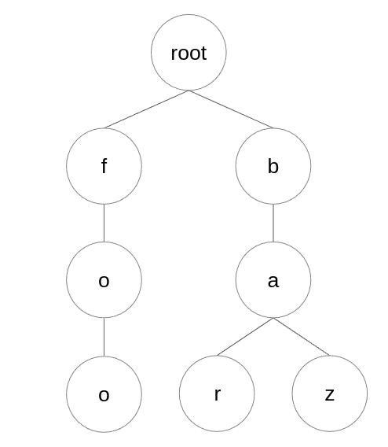
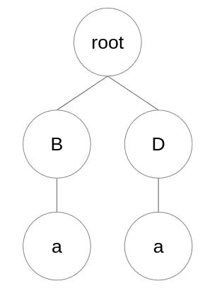

# search-tree



## Overview
This tree data structure is useful for finding all kept words given the prefix.
Hopefully should be much faster than using other data structures, such as vectors.

Visualisation of this data structure is shown in the picture above.

## Getting started
Typical use case of `Tree` class would look like as such:
```c++
#include "Tree.h"

Tree t;
t.put("bar"); // puts the word "baz" into a tree object t
t.put("baz"); // same with "bar"

// returns a vector of all words in a tree object with this prefix
t.find("ba"); // returns: { "bar", "baz" }
```

Alternatively, we can initialize a `Tree` object with a list of words to be put inside.
```c++
#include "Tree.h"

Tree t({ "bar", "baz" }); // puts all words from the list to the tree

t.find("ba"); // returns: { "baz", "bar" }
```

## Functionality
`Tree` class' API:
- `Tree.put(word)` - puts given word into a tree object and increments word counter.
- `Tree.remove(word)` - removes given word from a tree and decrements word counter. Does nothing if word wasn't there to begin with.
- `Tree.find(prefix)` - find and return a vector of all stored words with given prefix. Returns empty vector if there's none.
- `Tree.size()` - returns a number of stored words in a tree object.
- `Tree.root()` - returns an immutable reference to the root node of the tree.

## Problems with current implementation
Consider a case when we try to put "Ba" and "Da" into a tree.

That object would look like this:



As you can see, the 'a' node is being created for every parent node. This is BAD!
This means that memory size of the Tree object will grow exponentially.

Instead, both nodes 'B' and 'D' should use the same 'a' node.

I'll try to fix this problem in the next version of this project.
